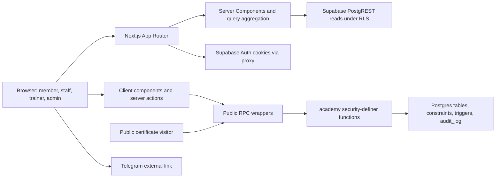

# Gentrep Academy — Project Brief and Continuation Plan

## Staging implementation update — 2026-08-15

Status: **staging foundation, database authorization, and password Auth are verified; authenticated browser acceptance remains pending**.

The approved isolated staging targets are Supabase project `qipwvvhmhxqzlmezvjxu` and Vercel project `mancerarogers-projects/gentrep-academy`, Preview only. Production, the chairman reference HTML, and the original migration were not changed.

Implemented and verified in staging:

- Applied the unchanged initial migration plus forward-only migrations `20260815090000_security_foundation.sql` and `20260815103000_advisor_hardening.sql`.
- Added strict staff-event and trainer-member assignment boundaries, one active primary trainer, sequential rank enforcement, idempotent progression and certificate issuance, opaque public certificate codes, immutable trainer-credit history, audited corrections, and a service-role-only staging-admin bootstrap.
- Added deterministic credential-free catalog fixtures, reserved staging-only mock identities/data, guarded cleanup, 61 pgTAP authorization/integrity checks, and a parallel-write progression test.
- Seeded 19 reserved mock profiles plus one invited admin. Current staging fixture totals are 5 ranks, 4 documents, 27 requirements, 20 events, 3 bookings, 2 attendance records, 30 requirement completions, 23 member-progress rows, 3 certificates, and 1 historical trainer-credit row. The increase from the previously recorded 29 completions has not been attributed and should be investigated before changing fixtures.
- Verified the one-role-per-identity invariant, historical trainer credit, public certificate lookup, cleanup/reseed idempotency, 12 unit tests, 61 database tests, the concurrency test, lint, type checking, and the production build.
- This implementation configured only Vercel Preview with the public Supabase URL and publishable key. Two Production-scoped variables with the same public names were already present in the Vercel project and were not modified or removed. No service-role secret was added to Vercel, no real environment file was committed, and the repository secret scan found no credentials or personal-email fixtures.
- Deployed the corrected Preview at `https://gentrep-academy-c9tty0wls-mancerarogers-projects.vercel.app`, including the invitation password-setup route at `/auth/setup` and the final sign-in accessibility corrections.

Admin Auth state:

- The original invitation targeted an earlier immutable Preview. After explicit owner authorization, the exact final `/auth/setup` URL was allow-listed and one replacement invitation was sent. Two invitation emails were sent in total; no recovery email was sent.
- The existing Auth identity was reused without duplication, has exactly the `admin` application role, and the role assignment is audited.
- After explicit owner authorization, a temporary password was set through the staging Admin API, the email identity was confirmed, and password sign-in succeeded. The credential is intentionally excluded from source, logs, fixtures, and documentation.
- Global self-signup remains disabled. Existing-user email/password Auth is enabled in hosted staging. The repository's local `supabase/config.toml` intentionally contains local-development values and must not be pushed to hosted staging without first reconciling the remote Site URL, redirect allow-list, and email-provider setting.

Remaining verification boundary:

- An anonymous Computer Use smoke test could not be completed because the Windows helper could not confidently determine the current Brave URL and stopped itself before interacting with the page.
- Password sign-in was verified directly against staging Auth, but no authenticated browser session was exercised. Responsive layout, keyboard navigation, route redirects after sign-in, and member/staff/trainer/admin browser journeys are **not claimed as browser-verified**.
- Supabase Security Advisor has no errors. Its remaining warning is disabled leaked-password protection; enable it if the selected Auth plan supports that feature. Performance-advisor RLS planning warnings remain non-blocking staging optimization work.

The historical audit below is retained for traceability. Statements marked unconfirmed in that snapshot describe the pre-staging repository state and are superseded where the update above provides direct 2026-08-15 staging evidence.

> Repository snapshot: 2026-08-15  
> Scope: `C:\Users\mance\Projects\gentrep-academy` at commit `f507a31` on `main`  
> Evidence standard: repository files and safe local verification only. Live Supabase behavior is `Unconfirmed` unless explicitly stated.

## Status vocabulary

- `Working`: verified through the complete relevant path.
- `Partially implemented`: meaningful frontend and backend pieces exist, but the complete path is incomplete or unverified.
- `UI only`: a user interface exists without a verified persistence path.
- `Backend only`: schema or logic exists without a usable interface.
- `Mock or placeholder`: behavior or data is simulated.
- `Planned but not implemented`: repository evidence states an intent, but implementation is absent.
- `Broken`: repository evidence shows the current path cannot fulfill its stated behavior.
- `Unable to verify`: implementation exists, but the required environment or safe end-to-end evidence is unavailable.

## 1. Executive Summary

Gentrep Academy is a member training and rank-progression portal for the GutGuard organization. It turns an approved chairman-provided dashboard prototype into a maintainable Next.js application backed by Supabase Auth and Postgres. Members are intended to complete bilingual documents, attend scheduled training, demonstrate skills to trainers, progress through five ranks, and receive publicly verifiable certificates. Staff, trainers, and administrators have separate operational responsibilities.

The repository is in a **production-shaped but not production-verified** condition. The application compiles, linting and type checking pass, 11 pure rule tests pass, and the production dependency audit reports no known vulnerabilities. The repository also contains a substantial initial database migration with RLS policies, transactional booking/waitlist functions, audit records, role guards, and certificate verification.

No complete product journey qualifies as `Working` yet because the migration, RLS rules, RPC functions, authentication, and role-specific workflows were not exercised against an isolated Supabase environment during this audit. Several important static issues also need resolution:

1. Staff and trainer assignment boundaries are contradicted by the SQL: any user with the general `staff` or `trainer` role can bypass the narrower event/member assignment check in privileged RPCs.
2. Rank locks are primarily presentation logic; authenticated members can call document and booking RPCs for later-rank requirements because the database functions do not enforce prerequisite rank completion.
3. Certificate issuance has a frontend selection defect: after a member already has any certificate, completing a different rank can route them to the old certificate instead of issuing the selected rank's certificate.
4. The document “video” is a simulated click target with no media source, while the UI contains unimplemented claims about scanning, switching dates, and waitlist notifications.
5. Public certificate URLs fall back to `http://localhost:3000` when `NEXT_PUBLIC_SITE_URL` is absent. The deployment value is `Unconfirmed` and must be verified before relying on QR/share links.

The immediate direction should be a small verification-and-integrity cycle: resolve the P0 owner decisions, connect an isolated Supabase project, execute the migration, and add role/RPC integration tests before adding product features.

## 2. Product Vision

### Confirmed facts

- **Problem being solved:** provide a durable record of member training requirements, attendance, demonstrations, rank progress, and certificates. Evidence: `README.md`, `src/components/academy/AcademyDashboard.tsx`, and `supabase/migrations/20260813120000_init.sql`.
- **Target users:** authenticated members plus users assigned `staff`, `trainer`, or `admin` roles. Evidence: `src/lib/academy/types.ts` (`APP_ROLES`) and `public.user_roles` in the migration.
- **Value proposition:** show each member what to do next, let them reserve sessions, keep verified progress records, and issue an externally verifiable internal distinction. Evidence: `AcademyDashboard`, `academy.book_event`, `academy.record_attendance`, `academy.verify_demonstration`, and `academy.issue_certificate`.
- **Educational model:** five sequential ranks (`BASE`, `TL`, `SL`, `PL`, `CC`) composed of document, attendance, demonstration, and derived requirements. Evidence: `src/lib/academy/rules.ts`, `src/lib/academy/types.ts`, and development-only catalog data in `supabase/seed.sql`.
- **Delivery model:** learning is primarily in-person; the app records supporting documents and evidence. Evidence: About Academy copy in `AcademyDashboard`.
- **Confirmed business goals:** preserve the chairman-approved member dashboard, use the GutGuard stack, avoid self-verification of attendance/demonstrations, and expose only minimum certificate fields publicly. Evidence: `AGENTS.md`, `README.md`, `reference/README.md`, migration functions, and `rules.test.ts`.

### Reasonable inferences

- Rank progression appears intended to be sequential, because `rankLockReason` requires the previous rank and the UI labels later ranks as locked. This is an inference about the business rule because SQL write paths do not currently enforce it.
- Staff and trainers appear intended to operate only on assigned events or members. Screen copy says “Assigned events” and “assigned demonstrations,” while the SQL also defines `event_staff` and `trainer_assignments`. The current RPC fallback to the general role conflicts with that intent.
- Certificates appear intended to be self-service after all requirements are independently verified. The UI shows the certificate button to the member and `academy.issue_certificate` permits the member to issue their own completed rank.

### Unconfirmed assumptions

- Whether accounts are self-registered, invited, imported, or created by an administrator.
- Whether a paid membership or active distributor status controls Academy access.
- Whether actual video assets exist and whether proof of playback is a compliance requirement.
- Whether one or multiple trainers may be assigned to a member.
- Whether the current rank and rank-completion rules match the owner's operational policy.
- Whether the production Supabase schema matches the repository migration.
- Whether the production deployment defines `NEXT_PUBLIC_SITE_URL` correctly.

## 3. User Roles and Permissions

| Role | Confirmed capabilities | Restricted capabilities | Evidence | Confidence |
| --- | --- | --- | --- | --- |
| Member | Sign in; read their dashboard; view rank requirements; accept matched documents; book/waitlist/cancel their own attendance sessions; read their own certificates; request certificate issuance when all requirements are done | Cannot directly self-record attendance or demonstration verification; cannot access staff/trainer/admin routes through route guards | `src/lib/auth/guards.ts`; `src/lib/actions/*`; `academy.book_event`, `academy.accept_document`, `academy.cancel_booking`, `academy.issue_certificate`; RLS policies | High for intended model; live enforcement unverified |
| Staff | Open `/staff/events`; read bookings/profile data allowed by RLS; record attended/absent status | Intended assignment restriction is unclear; current SQL permits any `staff` role to act even when not assigned to the event | `src/app/staff/events/page.tsx`; `loadStaffRoster`; `academy.record_attendance`; `bookings_self` policy | High confidence in the conflict |
| Trainer | Open `/trainer/verifications`; see assigned-member demonstration queue; confirm/reject demonstrations | Intended assignment restriction is unclear; current SQL permits any `trainer` role to act even when not assigned to the member | `src/app/trainer/verifications/page.tsx`; `loadTrainerQueue`; `academy.verify_demonstration` | High confidence in the conflict |
| Admin | Pass every role guard; view aggregate counts; use admin-authorized database policies and privileged RPC paths | No in-app user, role, event, content, assignment, certificate-revocation, or audit-management interface exists | `src/app/admin/page.tsx`; `requireRole`; admin RLS policies | High |

There are no other application roles in repository evidence. Host/upline/officer labels exist in content, but they are not independent authorization roles.

## 4. Main User Journeys

### 4.1 Sign in

- **Actor:** existing account holder.
- **Entry point:** `/login` or `/` redirect.
- **Steps:** enter email/password → React Hook Form and Zod validate → `signIn` server action → Supabase `signInWithPassword` → redirect to `/academy`.
- **Data changed:** Supabase auth session cookies.
- **Completion condition:** authenticated session redirects to the Academy.
- **Failure states:** missing environment, invalid form input, or Supabase auth error displayed in the form.
- **Status:** `Unable to verify`. UI and server action exist, but no safe live login was performed. There is no sign-up or recovery journey.
- **Evidence:** `src/app/page.tsx`, `src/app/login/page.tsx`, `src/components/auth/LoginForm.tsx`, `src/lib/actions/auth.ts`, `src/proxy.ts`.

### 4.2 View rank progress and choose the next requirement

- **Actor:** authenticated member.
- **Entry point:** `/academy` or `/academy/ranks/[rank]`.
- **Steps:** server loads profile, roles, ranks, requirements, documents, events, bookings, completions, certificates, and teams → maps the selected rank → derives progress and “do this next” → renders responsive dashboard.
- **Data changed:** none.
- **Completion condition:** selected rank and requirement states render.
- **Failure states:** missing profile/rank or primary profile-query error. Errors from most parallel queries are not checked and may appear as empty data.
- **Status:** `Partially implemented` and live data `Unable to verify`.
- **Evidence:** `loadDashboard` in `src/lib/academy/queries.ts`; `AcademyDashboard`.

### 4.3 Read/watch and accept a training document

- **Actor:** authenticated member.
- **Entry point:** a document requirement card.
- **Steps:** open sheet → choose English/Tagalog → click a simulated video surface → agree → Zod validates client payload → `accept_document` RPC stores document version/language and marks requirement done.
- **Data changed:** `document_acceptances`, `requirement_completions`, `audit_log`.
- **Completion condition:** requirement completion is `done`.
- **Failure states:** missing document, mismatched document/requirement, unauthenticated request, RPC error.
- **Status:** `Mock or placeholder` for video playback; backend acceptance is `Partially implemented` and live behavior is unverified. The server cannot prove media playback because “watched” is client-controlled and not persisted as evidence.
- **Evidence:** `DocumentSheet`; `acceptDocumentAction`; `acceptDocumentSchema`; `academy.accept_document`.

### 4.4 Book, waitlist, or cancel an attendance session

- **Actor:** authenticated member.
- **Entry point:** attendance requirement card.
- **Steps:** view matching scheduled events → choose an event → transactional RPC locks event → reject past/closed/duplicate booking → book or waitlist → update requirement status → audit. Cancellation releases a booked seat and attempts oldest-waitlist promotion.
- **Data changed:** `event_bookings`, `training_events.seats_taken`, `requirement_completions`, `audit_log`.
- **Completion condition:** booking/waitlist state persists; cancellation returns requirement to open.
- **Failure states:** event mismatch, duplicate active booking, past/closed session, invalid identifier, RPC error.
- **Status:** `Partially implemented`; concurrency logic exists but is not database-tested. UI does not filter scheduled events by start time, and event-to-requirement matching relies on identical text values.
- **Evidence:** `RequirementCard`; booking actions; `academy.book_event`, `academy.cancel_booking`, `academy.promote_waitlist`; partial unique indexes.

### 4.5 Record attendance

- **Actor:** staff or admin.
- **Entry point:** `/staff/events`.
- **Steps:** load visible bookings → click Present or Absent → `record_attendance` RPC writes an attendance record, changes booking status, updates requirement completion, and audits.
- **Data changed:** `attendance_records`, `event_bookings`, `requirement_completions`, `audit_log`.
- **Completion condition:** attendance becomes `done` or `missed`.
- **Failure states:** invalid status/booking, unauthorized actor, self-verification.
- **Status:** `Partially implemented`; assignment authorization and live relational queries are unverified. The UI exposes waitlisted bookings to attendance controls, and the RPC does not require the booking to be `booked`.
- **Evidence:** `StaffRoster`; `loadStaffRoster`; `academy.record_attendance`.

### 4.6 Verify a demonstration

- **Actor:** trainer or admin.
- **Entry point:** `/trainer/verifications`.
- **Steps:** load assigned members and all demonstration requirements → confirm/reject → RPC appends verification, updates requirement completion, and audits.
- **Data changed:** `trainer_verifications`, `requirement_completions`, `audit_log`.
- **Completion condition:** selected demonstration is `done` or `rejected`.
- **Failure states:** wrong requirement type, self-verification, unauthorized actor.
- **Status:** `Partially implemented`; general trainers can bypass assignment in the RPC, and live behavior is unverified.
- **Evidence:** `TrainerQueue`; `loadTrainerQueue`; `academy.verify_demonstration`.

### 4.7 Complete a derived requirement

- **Actor:** system trigger after a trainee certificate is issued.
- **Entry point:** insert/update on `certificates`.
- **Steps:** find one trainer assignment → map trainee rank to a hard-coded derived requirement code → upsert trainer's completion.
- **Data changed:** `requirement_completions`.
- **Completion condition:** the selected trainer receives the derived completion.
- **Failure states:** no assignment, no matching requirement, multiple trainer assignments resolved nondeterministically with `limit 1`.
- **Status:** `Backend only`, live behavior `Unable to verify`.
- **Evidence:** `academy.maybe_complete_derived` and `certificates_derived` trigger.

### 4.8 Issue, view, print, share, and publicly verify a certificate

- **Actor:** completed member or admin; public verifier.
- **Entry point:** completed rank button, `/academy/certificates/[id]`, or `/verify/[certificateId]`.
- **Steps:** check all requirements → issue unique reference → update rank progress/profile → render certificate and QR → print/share → anonymous RPC returns minimum public fields.
- **Data changed:** `certificates`, `member_rank_progress`, `profiles`, `audit_log`; derived trigger may update another member's completion.
- **Completion condition:** owned certificate exists and public verification returns issued/revoked status.
- **Failure states:** incomplete rank, duplicate certificate, incorrect site URL, certificate not found, RPC/query failure.
- **Status:** `Broken` for multi-rank issuance selection in the member UI; remaining path `Partially implemented` and live behavior unverified.
- **Evidence:** `AcademyDashboard` (`selectedCert` fallback), certificate page, `CertificateActions`, `qr.ts`, `academy.issue_certificate`, `academy.verify_certificate`.

### 4.9 Administrative overview

- **Actor:** admin.
- **Entry point:** `/admin`.
- **Steps:** read counts for profiles, events, and certificates; follow links to member/staff/trainer areas.
- **Data changed:** none.
- **Completion condition:** counts render.
- **Failure states:** query errors silently become zero.
- **Status:** `Partially implemented`; this is an overview, not an administrative management workflow.
- **Evidence:** `src/app/admin/page.tsx`, `loadAdminSummary`.

## 5. Current Feature Inventory

| Area | Feature | User role | Frontend | Backend | Database | Permissions | Status | Evidence |
| --- | --- | --- | --- | --- | --- | --- | --- | --- |
| Auth | Email/password sign-in | Existing user | Form with validation/error | Server action + Supabase Auth | Supabase Auth | Public entry; session required afterward | Unable to verify | `LoginForm`, `signIn` |
| Auth | Session refresh | Signed-in user | None | Next proxy calls `getClaims` | Auth cookies | Applies to matched routes | Unable to verify | `src/proxy.ts`, `supabase/proxy.ts` |
| Auth | Sign-out | Signed-in user | Buttons | Server action | Supabase Auth | Authenticated routes | Unable to verify | `signOut` |
| Auth | Registration/onboarding | New user | None | New-user DB trigger only | Creates profile/member role | Trigger-level | Planned but not implemented / requirement unconfirmed | `academy.handle_new_user` |
| Auth | Password recovery | User | None | None | None | None | Planned but not implemented / requirement unconfirmed | No route/action found |
| Member | Rank dashboard | Member | Responsive dashboard | Server query aggregation | 10 related tables | Self-read plus catalog reads | Partially implemented | `AcademyDashboard`, `loadDashboard` |
| Member | Sequential rank locks | Member | Desktop/mobile rank navigation | Pure helper only | No RPC prerequisite enforcement | UI hint only | Broken as an authorization/data rule | `rankLockReason`, `book_event`, `accept_document` |
| Learning | Bilingual document content | Member | English/Tagalog sheet | Acceptance RPC | Documents/acceptances/completions | Self action | Partially implemented | `DocumentSheet`, migration |
| Learning | Video playback/proof | Member | Clickable visual placeholder | Client boolean only | No media/evidence record | Client-controlled | Mock or placeholder | `.video` surface in `DocumentSheet` |
| Events | Event discovery | Member | Events inside requirement cards | Dashboard query | `training_events` | Authenticated catalog read | Partially implemented | `loadDashboard`, `RequirementCard` |
| Events | Booking | Member | Book button and feedback | Transactional RPC | Bookings/event counter/completion/audit | Authenticated member | Unable to verify | `book_event` |
| Events | Waitlist | Member | Full-event waitlist button | Queue + promotion RPC | Booking position/status | Authenticated member | Partially implemented | `promote_waitlist`; no notification delivery |
| Events | Cancellation | Member/admin | Cancel button | Cancellation RPC | Booking/counter/completion/audit | Owner or admin | Partially implemented | `CancelRow`, `cancel_booking` |
| Events | Switch date | Member | Mentioned in About copy | None | None | None | Planned but not implemented | About copy; no action/UI |
| Attendance | Staff roster | Staff/admin | Table | Relational query | Bookings/events/profiles | Intended assigned events; actual broad staff read | Partially implemented | `loadStaffRoster`, RLS |
| Attendance | Manual present/absent | Staff/admin | Buttons | RPC | Attendance/booking/completion/audit | Assignment rule conflicted | Partially implemented | `record_attendance` |
| Attendance | Door scanning | Staff | Mentioned in copy only | None | None | None | Planned but not implemented / requirement unconfirmed | About copy only |
| Demonstration | Trainer queue | Trainer/admin | Table | Assigned-member aggregation | Assignments/requirements/completions | Intended assigned members | Partially implemented | `loadTrainerQueue` |
| Demonstration | Confirm/reject | Trainer/admin | Buttons | RPC | Verification/completion/audit | Assignment rule conflicted | Partially implemented | `verify_demonstration` |
| Progress | Derived trainee outcome | Trainer/upline | Status message only | Certificate trigger | Assignments/completions | Security-definer trigger | Backend only | `maybe_complete_derived` |
| Certificates | Member self-issuance | Member/admin | Completed-rank button | RPC | Certificate/progress/profile/audit | Self after all requirements or admin | Broken for members with an earlier certificate | `selectedCert`, `issue_certificate` |
| Certificates | Owned certificate page | Member | Printable certificate | Dashboard query + QR generation | Certificates/ranks/profile | Explicit user-id check | Unable to verify | certificate route |
| Certificates | Print/save PDF | Member | Browser print dialog | None | None | Browser-local | UI only | `CertificateActions` |
| Certificates | Share | Member | Web Share/clipboard/prompt fallback | URL generation | None | Browser APIs | Partially implemented | `CertificateActions`, `qr.ts` |
| Certificates | Public verification | Visitor | Issued/revoked screen | Anonymous RPC | Certificate/profile/rank | Minimum-field security-definer function | Unable to verify | `/verify/[certificateId]`, `verify_certificate` |
| Team | Telegram link | Member | External-link button | None | `teams.telegram_url` | Member can read team/catalog | Partially implemented | dashboard/profile mapping |
| Team | Member count | Member | No confirmed use | Hard-coded value in query | No count query | N/A | Mock or placeholder | `teamMemberCount: 24` |
| Admin | Operational summary | Admin | Three counts | Aggregate reads | Profiles/events/certificates | Admin route guard/RLS | Partially implemented | `/admin`, `loadAdminSummary` |
| Admin | Catalog/user/event management | Admin | None; directs operator to SQL/Table Editor | Admin RLS policies only | Multiple catalog tables | Admin policies | Backend only | `/admin`, admin RLS policies |
| Audit | Privileged action audit | Admin | No audit screen | `academy.write_audit` | `audit_log` | Admin read | Backend only | migration |
| Notifications | Waitlist/event notifications | Member | Copy promises notification | None | No outbox/preferences | None | Planned but not implemented | No notification integration found |
| Storage | Media/file storage | Any | None | None | No storage migration/client | None | Planned but not implemented / requirement unconfirmed | No evidence found |
| Analytics | Product/ops analytics | Admin | Three totals only | None beyond counts | No events/warehouse | None | Planned but not implemented / requirement unconfirmed | No analytics code found |
| Payments | Payment/subscription/access gating | Any | None | None | No payment entities | None | Planned but not implemented / requirement unconfirmed | No evidence found |

## 6. Route and Screen Inventory

| Route | Screen purpose | Access level | Data source | Current state | Important notes |
| --- | --- | --- | --- | --- | --- |
| `/` | Choose login or Academy destination | Public | Environment + auth claims | Partially implemented | Redirect-only, dynamic |
| `/_not-found` | Framework fallback | Public | Next.js | Working framework output | Generated by Next.js |
| `/login` | Email/password sign-in | Public | Supabase Auth action | Unable to verify | No registration/recovery links |
| `/academy` | Current/default rank dashboard | Authenticated | Supabase tables through `loadDashboard` | Partially implemented | Main member entry |
| `/academy/ranks/[rank]` | Selected rank dashboard | Authenticated | Same dashboard query | Partially implemented | Invalid code falls back; future-rank lock not server-enforced |
| `/academy/events` | Redirect into dashboard event flow | Authenticated | None | Working redirect | No independent event screen; effectively a compatibility route |
| `/academy/certificates/[id]` | Owned printable certificate | Authenticated owner | Dashboard aggregation + QR generation | Unable to verify | Loads the full dashboard to find one certificate |
| `/staff/events` | Attendance roster | `staff` or `admin` | Bookings joined to events/profiles | Partially implemented | “Assigned” scope conflicts with RLS/RPC |
| `/trainer/verifications` | Demonstration queue | `trainer` or `admin` | Assignments + requirements + completions | Partially implemented | Query scopes assignments; RPC permits broader trainer role |
| `/admin` | Operational totals and role links | `admin` | Count queries | Partially implemented | No CRUD/assignment/audit tools |
| `/verify/[certificateId]` | Public certificate validity | Public/anonymous | `verify_certificate` RPC | Unable to verify | Query outage is presented as “not found”; QR has empty alt text |

There are no `route.ts` API handlers. Application writes use Next server actions and Supabase RPC. There is no `/academy/ranks` index, sign-up route, recovery route, profile/settings route, notifications route, or administrative management route. Role links are conditional in the desktop sidebar. `/academy/events` is reachable by URL and README but does not have its own navigation destination or screen.

## 7. Technical Architecture

### Repository map

- `src/app/`: Next.js App Router pages, layouts, global CSS, and proxy entry point.
- `src/components/academy/`: member dashboard, rank mark, and certificate browser actions.
- `src/components/auth/`: login form.
- `src/components/ops/`: staff and trainer operational tables.
- `src/lib/academy/`: query aggregation, domain types, pure rules, QR generation, and the only test file.
- `src/lib/actions/`: server actions for authentication and domain writes.
- `src/lib/auth/`: route/role guards.
- `src/lib/schemas/`: Zod input schemas.
- `src/lib/supabase/`: browser, server, admin, and proxy client constructors.
- `supabase/migrations/`: one initial schema/RLS/RPC migration.
- `supabase/seed.sql`: fictional development-only catalog, accounts, assignments, and progress.
- `reference/`: read-only approved prototype and its instructions.
- `scripts/`: one-off Python string-extraction helpers for the reference bundle; not package scripts.

### Frontend

- Next.js 16.3 App Router, React 19.2, strict TypeScript, and handwritten CSS.
- Server Components load data; `AcademyDashboard`, forms, and operations tables are client components.
- No Tailwind, shadcn, global state library, or client data-fetching/cache library.
- Local UI state uses React hooks; successful writes call `router.refresh()`.

### Backend and data access

- Reads use the cookie-bound Supabase server client directly against public tables under RLS.
- Writes use Zod-validated Next server actions that invoke public PostgREST RPC wrappers.
- Public wrappers call security-definer functions in the `academy` schema.
- There is no ORM and no custom HTTP API.

### Authentication and authorization

- Supabase email/password Auth.
- `src/proxy.ts` refreshes/validates claims on matched requests.
- Page guards check authenticated user and `user_roles`; admin bypasses role-specific page guards.
- Database RLS and RPC checks are intended to be the authoritative data boundary.

### File storage

- No Supabase Storage buckets, upload code, or media pipeline exists.
- QR codes are generated in memory as data URLs by `qrcode`.

### Validation

- Zod validates login and server-action inputs.
- PostgreSQL types, checks, foreign keys, unique indexes, and RPC checks provide database validation.
- Query-result shapes are manually mapped and frequently cast from `Record<string, unknown>`; no generated Supabase database types exist.

### Data fetching and caching

- `loadDashboard` performs ten parallel Supabase queries for every dashboard load.
- Academy, staff, trainer, admin, login, root, and verify paths are dynamic.
- There is no explicit cache policy, pagination, or query batching RPC/view.

### External services

- Supabase Auth/Postgres/PostgREST.
- Vercel is the documented hosting target.
- Google Fonts are loaded through `next/font` at build time.
- Telegram is an outbound team-chat link, not an integrated messaging service.

### Deployment and environment

- Package manager: npm; lockfile version is repository-controlled in `package-lock.json`.
- Required names: `NEXT_PUBLIC_SUPABASE_URL`, `NEXT_PUBLIC_SUPABASE_ANON_KEY`, `NEXT_PUBLIC_SITE_URL`; `SUPABASE_SERVICE_ROLE_KEY` is declared but its admin client is unused.
- `.env.local` is ignored and untracked.
- The modified, unstaged `.env.example` contains a real project URL and a publishable-key format in both key slots; the service-role slot does **not** contain a service-role/secret format. This is a misleading template/configuration mismatch, not confirmed secret exposure.
- No `vercel.json`, GitHub Actions workflow, Supabase `config.toml`, or release pipeline is present.

### Monitoring and error handling

- Basic inline alerts, toast feedback, and empty states exist.
- No structured logging, error reporting, metrics, tracing, analytics, or operational alerting is configured.
- Several queries ignore returned errors and convert failures into empty data or zero counts.

### Testing

- One Node test file covers pure TypeScript rules.
- No component, server-action, SQL/RPC, RLS, browser, accessibility, or end-to-end tests exist.
- The test named “cross-user access is denied” only asserts that two string identifiers differ; it does not exercise authorization.

## 8. Data Model

| Entity | Purpose | Important fields | Relationships | Security/ownership | Evidence |
| --- | --- | --- | --- | --- | --- |
| `teams` | Team identity/chat link | `name`, `telegram_url` | Profiles and team members | Any authenticated read; admin write | migration |
| `ranks` | Five-level Academy catalog | code, names, order, citation, visual fields | Requirements, profiles, progress, certificates | Any authenticated read; admin write | migration, seed |
| `profiles` | Application identity/profile | name, member card, team, current rank, demo flag | Auth user, roles, teams | Self update with protected fields; broad staff/trainer/admin read | migration |
| `user_roles` | Multi-role authorization | user, enum role | Profile | Self/admin read; admin write | migration |
| `team_members` | Team membership join | team, user | Teams/profiles | Self/same-team/admin read | migration |
| `training_documents` | Versioned bilingual text metadata | slug, version, language fields, body | Requirements, acceptances | Authenticated read; admin write | migration |
| `requirements` | Rank completion requirements | rank, code, type, title, order, document | Rank/document | Authenticated read; admin write | migration |
| `member_rank_progress` | Started/completed rank state | user, rank, status, timestamps | Profile/rank | Self/admin/trainer read; security-definer write | migration |
| `document_acceptances` | Versioned member agreement evidence | user, document/version, language, requirement | Profile/document/requirement | Self/admin read; RPC write | migration |
| `training_events` | Scheduled training sessions | type, time, venue, host, capacity, seats, status | Host/profile, staff, bookings | Authenticated read; admin write; RPC counter updates | migration |
| `event_staff` | Event-to-staff assignment | event, user | Event/profile | Assigned/admin/staff read | migration |
| `trainer_assignments` | Trainer-to-member assignment | trainer, member | Profiles | Trainer/member/admin read | migration |
| `event_bookings` | Reservation/waitlist record | event, user, requirement, status, position | Event/profile/requirement | Self/event staff/general staff/admin read; RPC write | migration |
| `attendance_records` | Attendance decision history | booking/event/user/requirement, status, recorder, notes | Operational entities | User/recorder/staff/admin read; RPC write | migration |
| `requirement_completions` | Current materialized requirement state | user, requirement, status, source, language, evidence | Profile/requirement | Self/admin/general trainer/general staff read; RPC/trigger write | migration |
| `trainer_verifications` | Demonstration decisions | member, requirement, trainer, status, notes | Profiles/requirement | Member/trainer/admin read; RPC write | migration |
| `certificates` | Rank distinction and public reference | user, rank, reference, status/revocation | Profile/rank | Self/admin read; anonymous minimum-field RPC | migration |
| `audit_log` | Privileged action trail | actor, action, entity, metadata, time | Logical links | Admin read; security-definer write | migration |

### Data-model gaps and risks

- **Unverified production schema:** the repository has one migration, but its application to the connected Supabase project is `Unconfirmed`.
- **Assignment ambiguity:** multiple trainers may be assigned to one member, but the derived-completion trigger chooses one with `limit 1` and no deterministic order.
- **Authorization scope conflict:** staff/trainer RLS and RPCs grant broad role-based visibility/action despite assignment tables.
- **Rank prerequisite gap:** document acceptance and booking validate requirement type/match but not the member's current/previous-rank completion.
- **Counter integrity:** `training_events.seats_taken` is mutable state with no constraint that it is less than or equal to capacity and no reconciliation mechanism against bookings.
- **String coupling:** `training_events.event_type` must equal `requirements.title`; there is no foreign key or stable event-type entity.
- **Team duplication:** `profiles.team_id` and `team_members` both represent membership with no synchronization trigger or invariant.
- **Progress duplication:** `member_rank_progress`, `profiles.current_rank_id`, certificates, and per-requirement completions overlap. The app derives completed ranks from completions, not `member_rank_progress`.
- **Attendance consistency:** more than one attendance record may exist for a booking; no current/reversal constraint is documented. The RPC also accepts waitlisted or already-finalized bookings.
- **Verification consistency:** multiple trainer verification rows may be appended for the same member/requirement, and `pending` exists in the enum but is not used by the UI action.
- **Ordering constraints:** requirement `sort_order` is not unique within a rank; waitlist positions are not constrained positive or unique per event.
- **Host integrity:** `host_rank_code` is free text rather than a foreign key/check against `ranks.code`.
- **Unused entities/clients:** `teamMemberCount` is hard-coded and unused; browser/admin Supabase client constructors are not imported; `member_rank_progress` is written but not read by the application.

## 9. Authentication, Roles, and Security

### Severity-ranked findings

| Severity | Finding | Evidence | Consequence | Status |
| --- | --- | --- | --- | --- |
| Critical | No confirmed critical vulnerability was established from repository evidence | Full static review and redacted scan | Live behavior could still change this assessment | Unconfirmed until integration tests |
| High | Any general staff user can pass `record_attendance` without event assignment | `academy.record_attendance`: assignment check is bypassed by `current_user_has_role('staff')`; RLS also exposes all bookings to staff | Unauthorized progress changes and broader member-data visibility within trusted staff accounts | Confirmed static issue |
| High | Any general trainer can verify a member without assignment | `academy.verify_demonstration`: assignment check is bypassed by `current_user_has_role('trainer')` | Unauthorized demonstration decisions and progress changes within trusted trainer accounts | Confirmed static issue |
| High | Later-rank writes are not protected by prerequisite checks | `academy.book_event` and `academy.accept_document` do not validate member rank progression; requirements/events are readable | Members can potentially accumulate future-rank progress by invoking server actions/RPCs with readable UUIDs | Confirmed static issue |
| High | Security tests do not exercise SQL, RLS, RPC, or role boundaries | Only `rules.test.ts`; “cross-user” test compares two strings | A passing test suite gives no authorization assurance | Confirmed assurance gap |
| Medium | Staff/trainers can read broad profile and completion datasets | `profiles_self_read`, `completions_self`, and related policies | More personal/progress data is exposed than assignment-only screens imply | Confirmed; owner intent needed |
| Medium | Raw Supabase/Postgres error messages can reach authenticated UI | generic `rpc` returns `error.message` | Internal schema/function details may be disclosed and UX is inconsistent | Confirmed static issue |
| Medium | Many read errors are silently treated as empty data or zero | `loadDashboard`, `loadStaffRoster`, `loadTrainerQueue`, `loadAdminSummary` | Operational outages can be mistaken for no records | Confirmed static issue |
| Medium | Client-only “watched” state is not trustworthy evidence | `DocumentSheet`, schema boolean, RPC lacks playback evidence | Agreement may be recorded without actual playback | Confirmed; severity depends on compliance requirement |
| Low | No application rate limiting, MFA, abuse control, or lockout policy is defined | No repository implementation | Supabase defaults may help, but deployment policy is unknown | Unconfirmed operational gap |
| Low | No password recovery or account-provisioning UI | No route/action | Support burden and unclear onboarding | Confirmed absence; requirement unconfirmed |

### Additional assessment

- Session handling uses current Supabase SSR patterns and server-side claims, but live cookie refresh was not tested.
- Route guards are useful UX gates; they are not sufficient without database authorization.
- The service-role client is server-only by construction, and the service-role variable is never prefixed `NEXT_PUBLIC_`.
- The admin client is currently unused. The modified `.env.example` puts a publishable-key format in the service-role slot; it would not provide admin privileges and should not be treated as a valid service-role configuration.
- The development seed intentionally includes fictional identities and a shared demo credential. It must remain development-only and should never be applied to a real member database.
- The public certificate RPC returns only certificate ID, member name, rank, reference, issue time, and status. The pure rule test confirms the intended minimal payload, but does not execute the SQL function.
- No Supabase Storage policies exist because there is no storage feature.
- No retention/deletion policy is documented for profiles, attendance notes, verification notes, or audit metadata.

## 10. UI, UX, and Design-System Status

### Confirmed strengths

- The approved member experience is reconstructed rather than importing the minified reference bundle. Evidence: `reference/README.md` and maintainable components under `src/components/academy/`.
- The visual system uses the documented bone, paper, ultramarine, ink, and gold palette, plus Fraunces and Inter Tight. Evidence: `AGENTS.md`, `src/app/layout.tsx`, `globals.css`.
- The dashboard has distinct mobile and desktop layouts, a sticky desktop sidebar, mobile rank ladder and action footer, responsive widths, print rules, and reduced-motion handling.
- Forms have labels, inline errors, autocomplete, pending states, and visible focus treatment.
- The member dashboard includes skip navigation, a semantic ordered requirement list, progressbar attributes, live toast status, empty states, and error alerts.
- English/Tagalog switching is present for seeded document content.

### Partial or missing states

- No route-level `loading.tsx` or `error.tsx` files exist. Loading is limited to action button states; server navigation has no tailored loading experience.
- Staff/trainer buttons discard action errors and refresh regardless. Cancellation also discards failure feedback.
- Public verification converts query errors and true absence into the same “not found” result.
- Invalid rank codes silently fall back rather than returning not found.
- Admin query errors become zero counts.
- The video surface is visual simulation rather than a media player.
- “Tap Switch,” “scan at the door,” and “you'll be told when a seat opens” do not match implemented behavior.
- “Download as PDF” opens browser print; the helper explains the manual step, but the button label still implies a direct file download.

### Accessibility risks requiring manual review

- Sheet/dialog components do not declare `aria-modal`, trap focus, restore focus, or close on Escape.
- Backdrop click-to-close may create confusing behavior for keyboard and screen-reader users.
- The public verification QR image uses empty alternative text despite carrying verification meaning.
- Staff/trainer tables do not have captions or a confirmed small-screen overflow treatment.
- Focus styles cover primary custom controls, but a full keyboard order and contrast audit was not run.
- No automated accessibility tests or browser/device review exists.

## 11. Quality and Verification Results

| Check | Command | Result | Key findings | Recommended response |
| --- | --- | --- | --- | --- |
| Repository state | `git status --short --branch` | Passed/read-only | `main` at `f507a31`, tracking `cigar/main`; `.env.example` and `AGENTS.md` were already modified | Preserve changes; review before any future commit |
| Installed dependencies | `npm ls --depth=0` | Passed | Expected direct dependencies installed; no missing/extraneous package reported | Keep lockfile authoritative |
| Unit tests | `npm run test` | Passed, 11/11 | Covers pure rank/booking/certificate helpers only | Add DB/RLS/RPC and journey tests before release claims |
| Lint | `npm run lint` | Passed | No ESLint findings | Retain in CI when CI is added |
| Type check | `npm run typecheck` | Passed | Strict TypeScript compiles | Generate Supabase DB types to reduce unsafe casts later |
| Production build | `npm run build` | Passed | Next.js 16.3 compiled all ten page routes and proxy | Does not validate external services |
| Production dependency audit | `npm audit --omit=dev --audit-level=low` | Passed | No known production dependency vulnerabilities reported at audit time | Re-run in CI; audit data is time-sensitive |
| Full dependency audit | `npm audit --audit-level=low` | Passed | No known vulnerabilities reported at audit time | Re-run regularly |
| Redacted secret/PII scan | Repository-native redacted scan | Passed with documented demo/config findings | No private-key material or service-role secret pattern found; fictional emails/member identifier and demo credential exist in seed/reference/README | Keep seed development-only; add a preventive secret scan before publishing |
| Live Supabase migration | Not run | Unable to verify | No isolated target or safe production authorization was established | Use a dedicated development project first |
| RLS/RPC integration | Not run | Unable to verify | No test harness and no live schema confirmation | Make this the next cycle's central deliverable |
| End-to-end auth/roles | Not run | Unable to verify | Would require controlled accounts and an isolated backend | Test member/staff/trainer/admin matrix in non-production |
| Browser/device/accessibility | Not run | Unable to verify | Static review only | Run after integrity fixes |
| Notifications/storage/payments | Not run | Not implemented | No integrations exist | Decide requirements before implementation |

## 12. Completed, Partial, and Missing Work

### Completed

These artifacts are confirmed complete as repository components, not as production-verified user journeys:

- Maintainable Next.js reconstruction of the approved dashboard.
- Strict TypeScript project configuration, lint configuration, npm lockfile, and production build path.
- Typed domain constants and pure rule functions for rank order, booking eligibility, waitlist ordering, and certificate eligibility.
- Initial Supabase schema containing 18 tables, RLS enablement, 26 policies, RPC wrappers, transactional booking logic, audit logging, and development-only seed data.
- Route-level authentication/role guards and server-action input validation.
- Public minimum-field certificate query design.
- Responsive/print visual foundation and basic interaction feedback.

### Partially Completed

- Authentication and session refresh: code exists; live behavior and account lifecycle are unverified.
- Member dashboard: rich UI and data mapping exist; query errors, rank enforcement, and live schema are unresolved.
- Booking/waitlist/cancellation: transactional SQL exists; live concurrency and promotion behavior are untested.
- Attendance and demonstration verification: interfaces and RPCs exist; assignment enforcement is conflicted.
- Certificates: schema, issuance, rendering, print/share, QR, and public verification exist; multi-rank issuance and canonical URL behavior need fixes.
- Admin: counts and database policies exist; operational management is outside the app.
- Bilingual content: supported for documents; content workflow/version operations are not defined.

### Missing or Not Started

Only confirmed or directly implied product needs are listed here:

- Isolated Supabase environment and repeatable migration/RLS/RPC verification.
- Enforced server-side rank prerequisites.
- Correct assigned-event/assigned-member authorization if assignment scope is confirmed.
- Reliable certificate issuance for each selected completed rank.
- Correct canonical certificate verification origin.
- Honest implementation or removal of video, scan, switch-date, and notification claims.
- Operator workflow for creating/updating events, assignments, and Academy content, unless Supabase Table Editor is explicitly accepted as the operating model.
- Account-provisioning workflow/documentation; exact product requirement remains open.

### Technical Debt

- Manual untyped Supabase row mapping and unchecked query errors: medium urgency because failures look like empty data.
- Ten-query dashboard fan-out: medium urgency after correctness; measure before optimizing.
- Duplicate/overlapping team and progress representations: medium data-model risk.
- Free-text event-to-requirement matching: high operational fragility.
- Unused browser/admin clients and unused/hard-coded profile fields: low immediate impact, but misleading.
- One pure test file and no CI: high assurance gap.
- Prototype-extraction scripts are one-off utilities with no documentation or package entry points: low urgency.

### Blockers

- Owner decisions on assignment scope, rank enforcement, account provisioning, certificate authority, and canonical deployment URL.
- A safe non-production Supabase project with migrations applied.
- Controlled test identities for all four roles and assignment combinations.
- Confirmation of which prototype copy describes real requirements versus aspirational behavior.

## 13. Requirements Traceability

| Product requirement | Source/evidence | Related implementation | Status | Missing work |
| --- | --- | --- | --- | --- |
| Preserve chairman-approved dashboard | `AGENTS.md`, `reference/README.md`, reference HTML | `AcademyDashboard`, CSS, rank mark | Partially implemented | Visual/browser comparison not performed |
| Email/password authentication | `AGENTS.md`, `README.md` | Login form, server action, Supabase SSR/proxy | Unable to verify | Provisioning, recovery, E2E auth |
| Sequential rank ladder | UI copy, `rankLockReason`, seeded rank order | Rank routes/nav, pure rule | Broken as server rule | Enforce prerequisites in RPC/database |
| Record document agreement | About copy and README | Document sheet/action/RPC/tables | Partially implemented | Real media decision; trusted evidence rule |
| Book training attendance | Approved dashboard/README | Event cards, booking RPC, partial indexes | Unable to verify | DB concurrency and E2E tests |
| Waitlist and promotion | UI copy, pure rules, SQL | Waitlist status/position/promotion | Partially implemented | Notification decision; integrity tests |
| Members cannot self-verify attendance | README and UI copy | Staff page, RPC self-check | Partially implemented | Assignment rule and integration test |
| Trainer verifies demonstrations | Rank requirements/UI copy | Trainer queue and RPC | Partially implemented | Assignment enforcement and tests |
| Derived completion from trainee certification | Seeded requirement copy | Certificate trigger | Backend only | Multi-trainer ownership rule and tests |
| Issue rank certificate only after completion | README/rules | RPC count gate, unique certificate | Broken in multi-rank UI; backend unverified | Fix selected-rank issuance and test |
| Public verification exposes minimum data | README/test | Anonymous RPC and verify route | Unable to verify | Live RLS/RPC test; outage state |
| Role separation | Role enum/routes/README | Guards, RLS, functions | Partially implemented | Resolve broad staff/trainer access |
| Administrative operations | Admin route and policies | Counts and DB policies | Backend only/partial UI | Decide Table Editor vs in-app operations |
| Telegram team support | Approved dashboard/profile model | External link | Partially implemented | Validate team data and link policy |
| Vercel deployment | `README.md`, env helpers | Next build and environment contract | Partially implemented | Confirm site URL and live schema |
| Payment/membership access | No repository requirement | None | Unconfirmed | Owner decision; do not build by default |
| General LMS lessons/assessments | No repository requirement beyond documents/events | None | Unconfirmed | Do not add without approval |

Code with no confirmed current user story includes `createBrowserSupabaseClient`, `createAdminSupabaseClient`, the service-role variable, and the unread `teamMemberCount`. Retain only if a near-term approved use exists.

## 14. Decisions Already Embedded in the Project

| Decision | Evidence | Likely reason | Current consequences | Disposition |
| --- | --- | --- | --- | --- |
| Chairman prototype is immutable UI baseline | `AGENTS.md`, `reference/README.md` | Preserve approved stakeholder design | Member UI should not be casually redesigned | Retain |
| Next.js App Router + strict TypeScript | `package.json`, `tsconfig.json` | Canonical GutGuard web stack | Server Components/actions and proxy conventions | Retain |
| Supabase Auth/Postgres/RLS without ORM | README, clients, migration | Centralized auth/data policy and fewer layers | SQL quality and integration tests are critical | Retain; verify |
| Authoritative writes use RPCs | `src/lib/actions/academy.ts`, migration | Transactionality, audit, RLS-independent business checks | Security-definer functions become the highest-risk boundary | Retain; harden/test |
| Handwritten portable CSS; no Tailwind/shadcn | `AGENTS.md`, `globals.css` | Design-system portability and visual fidelity | Small custom component layer | Retain |
| Email/password only | `AGENTS.md`, login form | Simple member access | Provisioning/recovery remain undefined | Review lifecycle, retain method by default |
| Four application roles with admin override | types, guards, role table | Clear operational separation | Multi-role users supported; broad role bypasses exist | Retain roles; review scope |
| Members self-book and may self-trigger certificate issuance | UI/actions/SQL | Reduce operational burden after independent evidence | Needs rank and certificate correctness | Review/confirm |
| Attendance and demonstration cannot be self-verified | README and SQL checks | Evidence integrity | Requires trusted staff/trainer assignment | Retain |
| Public certificate verification is minimal | verify function/test | Privacy-safe external validation | Member name and rank are public by certificate ID | Retain; confirm consent/retention |
| English and Tagalog document variants | schema/UI/seed | Local accessibility and comprehension | Content versioning must cover both variants | Retain if content owners support it |
| Development seed is fictional and isolated | `README.md`, `supabase/seed.sql` | Safe local demonstration | Must never be loaded into real data | Retain |
| Admin uses Supabase SQL/Table Editor for corrections | `/admin` copy | Keep early UI scope small | Nontechnical operations depend on backend console access | Review before real operations |
| Vercel + npm | README, lockfile | Canonical deployment/tooling | Environment configuration is external to Git | Retain |

“Likely reason” entries are inference, not recovered project history.

## 15. Open Questions for the Project Owner

### Product and Business

| Priority | Question | Why it matters / dependent decision | Recommended default and options |
| --- | --- | --- | --- |
| P1 | Is Gentrep Academy only a training/progress portal, or must active distributor/membership status gate access? | Changes profile/access entities, onboarding, revocation, and possibly payments | Default: no payment/access integration in MVP. Options: admin-managed eligibility (small), external membership sync (medium/large), integrated billing (large) |
| P2 | Which outcomes define success: activation completion, attendance, time-to-rank, retention, or something else? | Determines later reporting and analytics | Default: operational counts only until a metric is explicitly approved |

### Users and Permissions

| Priority | Question | Why it matters / dependent decision | Recommended default and options |
| --- | --- | --- | --- |
| P0 | Are staff restricted to events in `event_staff`, or may all staff manage every event? | Directly determines RLS, roster query, and attendance RPC authorization | Default: assigned events only (least privilege). Global staff is simpler but exposes all rosters |
| P0 | Are trainers restricted to members in `trainer_assignments`, or may all trainers verify anyone? | Directly determines verification integrity and progress ownership | Default: assigned members only. Global trainers are simpler but weaken accountability |
| P0 | Can a member have multiple trainers, and who receives derived credit? | Current trigger chooses an arbitrary assignment | Default: one active primary trainer per member; alternative requires explicit credit allocation/history |
| P0 | How are accounts created: self-sign-up, invite, admin provisioning, or external import? | Blocks onboarding, profile completeness, email verification, and support flow | Default: admin invite/provisioning for the first controlled release; self-sign-up needs eligibility and abuse rules |

### Learning and Content

| Priority | Question | Why it matters / dependent decision | Recommended default and options |
| --- | --- | --- | --- |
| P0 | Must previous ranks be completed before members may view or complete later-rank requirements? | Controls server authorization and data integrity | Default: enforce completion before later-rank writes; optionally allow read-only preview |
| P1 | Are the document “videos” real media, and is actual playback evidence required? | Determines storage/player/event tracking and legal meaning of acceptance | Default: call them reading/orientation content unless approved media URLs exist; client click is not proof |
| P1 | Who owns document versions and bilingual approvals? | Version changes affect acceptance records and compliance | Default: named content owner approves EN/TL together; old acceptances remain tied to their exact version |

### Enrollment and Access

| Priority | Question | Why it matters / dependent decision | Recommended default and options |
| --- | --- | --- | --- |
| P0 | What exactly advances `current_rank_id`: completing requirements, issuing a certificate, or administrator approval? | Current code derives locks from completions but updates profile on certificate issuance | Default: verified requirements make a rank eligible; certificate issuance finalizes it; next rank becomes active explicitly |
| P0 | Who is allowed to issue a certificate: the completed member, staff/trainer, admin, or an automatic system step? | Determines the final authority in the evidence chain and the certificate UI/RPC contract | Default: automatic/self-service issuance only after independently verified requirements; use admin for correction/revocation |
| P1 | Can members attend training before it is required for their active rank? | Determines event discovery and booking authorization | Default: allow viewing catalog, restrict booking to active/unlocked requirements |

### Payments or Membership

| Priority | Question | Why it matters / dependent decision | Recommended default and options |
| --- | --- | --- | --- |
| P1 | Is payment, subscription, product purchase, or distributor status required for Academy access? | A “yes” introduces external source-of-truth, sync, revocation, and audit requirements | Default: exclude all payment logic from MVP until an authoritative system and policy are named |

### Administration and Reporting

| Priority | Question | Why it matters / dependent decision | Recommended default and options |
| --- | --- | --- | --- |
| P0 | Is Supabase Table Editor an acceptable operations tool for the first release, or must admins manage users, events, roles, assignments, and content in the app? | Determines whether the current admin route is sufficient for MVP | Default: Table Editor only for a controlled pilot with trained operators; in-app tools before broader rollout |
| P1 | Are attendance/verification decisions reversible, and must the history be visible? | Determines uniqueness, correction RPCs, audit UI, and retention | Default: append corrections with reason and preserve immutable audit history |
| P1 | Which reports are actually required and by whom? | Avoids speculative analytics scope | Default: defer beyond counts until owner names decisions each report supports |

### Branding and User Experience

| Priority | Question | Why it matters / dependent decision | Recommended default and options |
| --- | --- | --- | --- |
| P1 | Should unimplemented claims (“scan,” “Switch,” waitlist notification, real video) be removed for the first release or implemented? | Current copy creates false expectations | Default: replace with honest current behavior unless the related feature is explicitly approved |
| P2 | Is the chairman prototype still the final approval baseline for all member screens? | Controls future UI change authority | Default: yes for member flows; use GutGuard system for new operational screens |

### Technical and Deployment

| Priority | Question | Why it matters / dependent decision | Recommended default and options |
| --- | --- | --- | --- |
| P0 | Which isolated Supabase project is approved for migration/RLS/RPC testing? | Live verification cannot proceed safely against an unknown/production database | Default: dedicated development project with fictional test identities only |
| P0 | What is the canonical production site URL for certificate QR/share links? | `getSiteUrl` otherwise falls back to localhost | Default: the stable custom/production Vercel origin; previews should use an explicit preview-origin policy |
| P1 | What retention/privacy policy applies to member names/cards, attendance notes, verification notes, and audit logs? | Determines schema, deletion/export, and staff visibility | Default: collect minimum fields, restrict by assignment, and define retention before real users |
| P1 | What monitoring and incident owner are required for launch? | There is no error reporting or operational alerting | Default: structured server errors plus one approved error-monitoring service before broad rollout |

## 16. Recommended Product Scope

### Minimum Viable Product

The smallest coherent product is the currently evidenced Academy loop, made trustworthy:

- Controlled account provisioning and email/password sign-in.
- Member profile plus one active sequential rank.
- Approved bilingual documents/agreements with honest media behavior.
- Event list, booking, cancellation, and waitlist with transactional integrity.
- Assigned staff attendance and assigned trainer demonstration verification.
- Derived completion under an explicit primary-trainer rule.
- One certificate per completed rank with correct QR/share origin and public minimum-field verification.
- Minimal operations model for catalog/events/assignments, either explicitly documented Supabase operations for a small pilot or narrow in-app tools.
- Audit records and tested least-privilege role boundaries.

These belong in MVP because each is already part of the confirmed progress-and-certification promise; removing one breaks the evidence chain.

### Post-MVP

- Password recovery and a refined invitation/onboarding flow.
- In-app corrections/reversals with audit history.
- Waitlist and schedule notifications after delivery channel/consent are approved.
- Operational reports tied to named decisions.
- Improved loading/error states, accessibility remediation, and mobile operations tables.
- Content/version management if Supabase Table Editor is no longer acceptable.

These follow once the core evidence path is secure and repeatable.

### Future Possibilities

- Payments/subscriptions or external membership synchronization.
- General LMS lessons, quizzes, assessments, community feeds, direct messaging, or support tickets.
- Native mobile apps, offline operation, advanced analytics, gamification, and broader content authoring.

No repository evidence requires these. They should not influence current architecture until explicitly approved.

## 17. Prioritized Continuation Roadmap

| Priority | Work item | Why it matters | Dependencies | Acceptance criteria | Estimated complexity |
| --- | --- | --- | --- | --- | --- |
| P0 | Resolve owner decisions and record access/rank/certificate rules | Prevents implementing contradictory authorization | P0 answers in section 15 | Written decisions identify actor, scope, and authority | Small |
| P0 | Establish isolated Supabase verification environment | Required for safe migration and role testing | Approved project and credentials | Migration applies from empty DB; fictional test users only | Medium |
| P0 | Build RPC/RLS integration harness | Current unit tests provide no security assurance | Isolated DB | Automated matrix proves allowed and denied operations for all roles | Large |
| P0 | Enforce event/member assignment boundaries | Protects member progress and data | Owner scope decisions + tests | Unassigned staff/trainers cannot read/act; assigned/admin paths pass | Medium |
| P0 | Enforce sequential rank writes | Protects rank integrity | Rank policy decision + tests | Later-rank book/accept/issue attempts fail until prerequisite is met | Medium |
| P0 | Repair certificate issuance and URL contract | Core completion output is currently unreliable | Canonical site URL decision | Each completed rank issues/opens its own cert; public URL is non-local and verified | Medium |
| P1 | Harden query/action error handling | Prevents outages appearing as empty data | Error contract | Reads distinguish no data from failure; actions display safe actionable errors | Medium |
| P1 | Align product copy with implemented behavior | Prevents false user expectations | Video/scan/switch/notification decisions | Every claim maps to working behavior or is removed | Small |
| P1 | Define and implement operational data workflow | Events/content/assignments must be maintainable | Admin operating-model decision | Named operator can perform approved tasks safely and auditably | Large |
| P2 | Add browser journey and accessibility coverage | Protects UX across roles/devices | Stable core paths | Automated smoke journeys plus documented keyboard/mobile review | Medium |
| P2 | Add CI quality gates | Prevents regressions | Stable test commands | PR/push runs lint, typecheck, tests, build, audit/secret checks | Medium |
| P3 | Add approved notifications/reporting | Useful only after core data is reliable | Channel/consent/report decisions | Delivery/report accuracy measured against accepted requirements | Large |

## 18. Recommended Next Development Cycle

### Cycle objective

Prove and harden the authorization/data-integrity boundary for the existing MVP against an isolated Supabase project.

### Included work

- Record approved P0 rules for rank progression, staff scope, trainer scope, trainer ownership, certificate authority, and account provisioning.
- Create/link an isolated Supabase development project without real member data.
- Apply `20260813120000_init.sql` and a purpose-built test fixture set.
- Build integration tests for member, assigned/unassigned staff, assigned/unassigned trainer, and admin.
- Correct only the authorization/rank/certificate defects demonstrated by failing tests.
- Verify canonical certificate URL configuration in development/preview.
- Re-run current lint, typecheck, unit tests, build, audits, and the new integration suite.

### Explicitly excluded work

- UI redesign.
- Payments, general LMS, community, analytics, and notifications.
- New content-management or reporting screens.
- Real member import or production migration.
- Video hosting, scanning, or mobile app work unless needed to remove inaccurate copy.

### Dependencies

- Answers to all P0 questions.
- Approved isolated Supabase project.
- Fictional controlled users for each role/assignment combination.
- Canonical production/preview URL policy.

### Ordered implementation steps

1. Write an owner-approved authorization/rank contract.
2. Apply the migration to an empty development project and record any SQL failures.
3. Create minimal fictional role/assignment fixtures.
4. Write failing RLS/RPC tests for allowed and denied paths.
5. Correct assignment and rank-prerequisite logic in a new migration.
6. Add certificate-per-selected-rank and canonical-origin regression coverage.
7. Exercise login → member writes → staff/trainer verification → certificate → public verification.
8. Run full repository checks and document residual gaps.

### Acceptance criteria

- No unassigned staff/trainer can read or mutate protected member progress under the approved model.
- Members cannot complete/book/issue later-rank work before prerequisites.
- Booking capacity/waitlist behavior remains atomic under concurrent attempts.
- Each completed rank issues and opens the correct certificate.
- Verification URLs use the approved non-local origin.
- All existing and new checks pass in a clean checkout.

### Tests or checks required

- SQL migration from empty database.
- RLS select matrix.
- RPC allowed/denied matrix.
- Booking concurrency and waitlist promotion.
- Certificate issuance/duplicate/selected-rank/public-payload tests.
- Authenticated route smoke tests for all roles.
- `npm run test`, `npm run lint`, `npm run typecheck`, `npm run build`, and dependency/secret checks.

### Definition of done

The cycle is done only when the isolated database can be rebuilt repeatably, the approved role/rank rules are executable tests, the demonstrated defects are fixed by migrations/code, and no production data or secrets were used.

### Decisions needed before starting

All P0 questions in section 15, especially assigned-vs-global staff/trainer scope and sequential rank enforcement.

## 19. Suggested First 10 Tasks

### Task 1 — Approve the authorization and progression contract

- **Goal:** turn P0 owner answers into precise rules.
- **Relevant files/modules:** this brief, `src/lib/auth/guards.ts`, migration authorization functions.
- **Dependencies:** project owner.
- **Expected output:** approved role/rank/certificate decision record.
- **Acceptance criteria:** every privileged action has a named actor, target scope, prerequisites, and denial behavior.
- **Main risk:** ambiguous answers perpetuate conflicting code.

### Task 2 — Prepare an isolated Supabase development project

- **Goal:** create a safe repeatable integration target.
- **Relevant files/modules:** `.env.example`, migration, seed strategy.
- **Dependencies:** approved project/environment owner.
- **Expected output:** isolated environment with no real members.
- **Acceptance criteria:** environment names documented; secret values remain outside Git; empty rebuild is possible.
- **Main risk:** accidentally targeting production.

### Task 3 — Validate the initial migration from empty state

- **Goal:** prove schema/functions/policies install cleanly.
- **Relevant files/modules:** `supabase/migrations/20260813120000_init.sql`.
- **Dependencies:** Task 2.
- **Expected output:** migration report and reproducible command.
- **Acceptance criteria:** all 18 tables, functions, triggers, grants, and policies exist as expected.
- **Main risk:** testing only a partially pre-existing schema.

### Task 4 — Create minimal fictional integration fixtures

- **Goal:** support role and assignment matrices without using broad demo data.
- **Relevant files/modules:** test fixture/seed location to be chosen; existing `supabase/seed.sql` as reference only.
- **Dependencies:** Tasks 1–3.
- **Expected output:** member, assigned/unassigned staff, assigned/unassigned trainer, admin, events, and requirements.
- **Acceptance criteria:** fixtures are deterministic, fictional, and isolated from production seed usage.
- **Main risk:** fixtures accidentally encode unapproved business rules.

### Task 5 — Add RLS and RPC authorization tests

- **Goal:** make the real database boundary executable.
- **Relevant files/modules:** migration policies/functions and new integration test harness.
- **Dependencies:** Tasks 1–4.
- **Expected output:** allowed/denied matrix tests.
- **Acceptance criteria:** tests fail against current assignment bypasses and cover cross-user reads/writes.
- **Main risk:** service-role tests accidentally bypass RLS and create false confidence.

### Task 6 — Fix staff/trainer assignment enforcement

- **Goal:** implement the approved least-privilege model.
- **Relevant files/modules:** `academy.is_event_staff`, `academy.is_assigned_trainer`, relevant RLS policies/RPCs, roster/queue queries.
- **Dependencies:** Task 5.
- **Expected output:** new forward migration and aligned queries.
- **Acceptance criteria:** assigned and admin paths pass; unassigned role holders fail.
- **Main risk:** breaking legitimate global operators if the owner actually wants global scope.

### Task 7 — Enforce rank prerequisites in authoritative writes

- **Goal:** prevent premature later-rank progress.
- **Relevant files/modules:** booking/document/certificate RPCs, rank/progress helpers.
- **Dependencies:** Tasks 1 and 5.
- **Expected output:** database helper/policies and regression tests.
- **Acceptance criteria:** readable UUIDs cannot bypass active-rank rules; approved read-only previews still work.
- **Main risk:** circular or unclear definition of rank completion/current rank.

### Task 8 — Repair certificate selection and canonical URLs

- **Goal:** make every completed rank's certificate usable.
- **Relevant files/modules:** `AcademyDashboard`, `qr.ts`, env contract, certificate routes/RPC tests.
- **Dependencies:** canonical URL and certificate authority decisions.
- **Expected output:** rank-specific issuance/opening and environment-safe verify links.
- **Acceptance criteria:** prior certificates do not block a new rank; generated URL is correct in development/preview/production policy.
- **Main risk:** hard-coding a deployment URL that breaks previews/custom domains.

### Task 9 — Establish safe query/action error contracts

- **Goal:** distinguish outages, permission failures, absence, and validation errors.
- **Relevant files/modules:** `queries.ts`, `actions/*.ts`, staff/trainer components, verify route.
- **Dependencies:** stable integration environment.
- **Expected output:** typed result/error handling and user-safe messages.
- **Acceptance criteria:** no failed query silently renders zero/empty; internal database messages are not exposed.
- **Main risk:** over-general errors that make operations hard to diagnose.

### Task 10 — Add role journey smoke tests and CI

- **Goal:** protect the verified core continuously.
- **Relevant files/modules:** all routes/actions, package scripts, new workflow configuration.
- **Dependencies:** Tasks 3–9.
- **Expected output:** automated member/staff/trainer/admin/public journeys and quality pipeline.
- **Acceptance criteria:** clean checkout runs lint, typecheck, unit/integration tests, build, and security checks; failures block merge.
- **Main risk:** flaky tests coupled to shared external state.

## 20. Recommended Next Action

> The next best action for Gentrep Academy is: **answer the P0 owner questions and authorize an isolated Supabase verification environment, then make the role/RPC test matrix the next development cycle.**

This must happen before new features because the current repository already contains the product's core flows, but their authoritative database boundary is unverified and contains confirmed assignment/rank-rule conflicts. Testing and correcting that boundary delivers more real progress than expanding the interface, and it preserves the approved frontend while keeping scope controlled.
