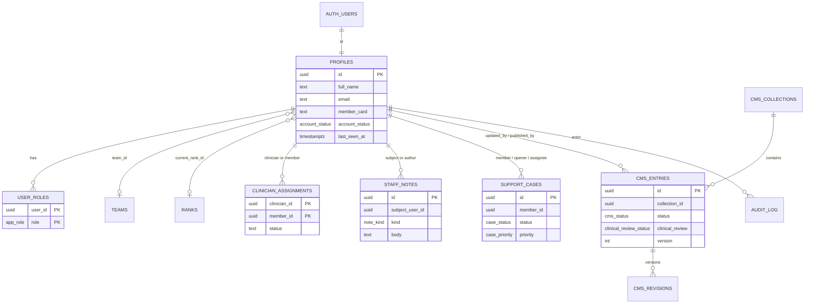

# GutGuard Admin Portal — Technical Specification

Enterprise operations desk for **GutGuard Lifestyle**, implemented in this Gentrep Academy repo. Member training stays on `/academy`. The admin portal is a separate, permission-gated workspace at `/admin`.

Product-repo copy for Mancera’s Obsidian note: `docs/To do Mancera.md` (vault-read gate + phased to-do). Do not edit the Design System or Tech Stack vaults.

---

## 1. HCI principles

The portal is a **workbench**, not a second product. Every screen answers three questions: *who is this for*, *what is the next action*, *what must stay hidden*.

| Principle | How it shows up |
|---|---|
| Role-home, not a kitchen sink | `/admin` (“Today”) is a persona snapshot. Navigation is filtered by capability. |
| Progressive disclosure | Directory → record → one action. CMS library → editor → workflow buttons that actually apply. |
| Least privilege in the UI | Unafforded controls are omitted, not disabled. Support never sees a clinical note field. |
| Search before browse | People and tickets open on a filter bar. Tables are the desktop pattern; cards are the tablet pattern. |
| One primary action | Publish, save note, or change ticket status — never a toolbar of equal-weight buttons. |
| Recognition over recall | Status chips, uppercase micro-labels, Fraunces titles, bone/blue/ink/gold tokens. |
| Separate academy ops | Staff check-in and trainer queues stay on `/staff` and `/trainer`. Super Admin can jump there from a quiet rail group. |

Responsive target is **desktop and tablet**. Phone is a compressed rail + stacked canvas, not a redesigned mobile app.

---

## 2. Role-based access control

Academy operational roles stay on `public.app_role`: `member`, `trainer`, `staff`, `admin`. The portal adds `clinician` and `support`. Product names map onto those values:

| Persona | `app_role` | Home | Sees |
|---|---|---|---|
| Super Admin | `admin` | `/admin` | Entire portal, academy desks, audit, publish, role assignment |
| Clinician / Dietitian | `clinician` | `/admin` | Assigned caseload, clinical notes, protocol/education CMS, clinical review |
| Customer Support | `support` | `/admin` | Directory (no clinical notes), tickets, account holds, published CMS |

`admin` remains the academy superuser (existing RLS bypass). A user may hold more than one role; Super Admin wins for navigation and field masks.

### 2.1 Capability matrix

Capabilities live in `src/lib/admin/rbac.ts` and are the only UI gate. Postgres still enforces the same rules.

| Capability | Super Admin | Clinician | Support |
|---|---|---|---|
| `portal.access` / `overview.read` | yes | yes | yes |
| `users.directory` | yes | — | yes |
| `users.read_assigned` | yes | yes | yes |
| `users.read_pii` | yes | assigned | limited |
| `users.read_clinical` | yes | assigned | — |
| `users.write_profile` | yes | assigned, limited | identity only |
| `users.write_status` | yes | — | active / suspended |
| `users.write_roles` | yes | — | — |
| `caseload.read` / `caseload.write` | yes | own caseload | — |
| `notes.write_clinical` | yes | assigned | — |
| `notes.write_support` | yes | — | yes |
| `content.read` | yes | yes | yes (no edit) |
| `content.write` | yes | protocol, education | — |
| `content.clinical_review` | yes | yes | — |
| `content.publish` | yes | — | — |
| `tickets.read` / `tickets.write` | yes | — | yes |
| `audit.read` / `settings.write` | yes | — | — |

Clinicians open a member record only when `clinician_assignments` is active for that pair. Support can search the directory and must not receive `clinicalNotes` in the field mask.

### 2.2 Sign-in routing

`homePath(roles)`:

1. Any portal role → `/admin`
2. Else `trainer` → `/trainer/verifications`
3. Else `staff` → `/staff/events`
4. Else `/academy`

---

## 3. Page architecture

Routes are App Router pages under `src/app/admin`. The layout loads the session, then `AdminShell` renders a capability-filtered rail.

```
AdminShell
├── Rail (brand, persona, nav, academy desks, account)
├── Top bar (tablet menu, “Lifestyle operations”)
└── Canvas
    └── Page (Today | People | Record | Caseload | CMS | Tickets | Audit)
```

### 3.1 Today — `/admin`

**For:** all portal roles (different KPIs).

| Sub-components | Actions |
|---|---|
| `KpiStrip` | None (read) |
| Start-here buttons | Jump to the first allowed work queue |
| `AuditFeed` (Super Admin) | Open `/admin/audit` |

Super Admin: people, tickets, in-review CMS, published CMS.  
Clinician: caseload size, entries waiting review.  
Support: open tickets, directory size, published answers.

### 3.2 People — `/admin/users`

**For:** Super Admin, Support. Hidden from clinicians.

| Sub-components | Actions |
|---|---|
| `FilterBar` (q, status) | Search name / email / card; filter account status |
| `UserDirectory` table | Open a member 360 |

### 3.3 Member record — `/admin/users/[id]`

**For:** Super Admin, Support (any member); Clinician (assigned only).

| Sub-components | Actions |
|---|---|
| Identity header + `StatusChip` | — |
| Academy / card / clinician / roles cards | Shown per field mask |
| Account controls | Super Admin: invited / active / suspended / closed. Support: hold / lift hold |
| Note composer | Clinical or support note, never both for the same role |
| Notes feed | Read allowed kinds only |
| Tickets list | Support: open a follow-up ticket |

### 3.4 Caseload — `/admin/caseload`

**For:** Clinician, Super Admin.

| Sub-components | Actions |
|---|---|
| `CaseloadBoard` cards | Open assigned member record |

### 3.5 Content CMS — `/admin/content`, `/admin/content/new`, `/admin/content/[id]`

**For:** all portal roles (write gated).

| Sub-components | Actions |
|---|---|
| `FilterBar` (collection, status) | Narrow the library |
| `CmsLibrary` | Open editor; Super Admin / clinician: New entry |
| `CmsEditor` | Save draft; submit review; approve / reject; publish; archive |

Workflow (`src/lib/admin/cms.ts`):

- `education`, `faq`, `announcement` → Super Admin may publish from draft.
- `protocol`, `product_copy` → must be `in_review` then `clinical_review = approved` before publish.
- Clinician authors `protocol` and `education` only. Support is read-only.

### 3.6 Tickets — `/admin/tickets`

**For:** Support, Super Admin.

| Sub-components | Actions |
|---|---|
| `FilterBar` (status) | Inbox slice |
| `TicketInbox` | Change status; jump to member |

### 3.7 Audit — `/admin/audit`

**For:** Super Admin. Append-only. No edit.

---

## 4. Component hierarchy

```
src/app/admin/layout.tsx
└── AdminShell
    ├── NavList (capability-filtered PORTAL_NAV)
    ├── Academy desk links (admin only)
    └── children
        ├── Today          KpiStrip, AuditFeed
        ├── People         FilterBar, UserDirectory, StatusChip
        ├── User record    UserRecord
        ├── Caseload       CaseloadBoard
        ├── CMS            CmsLibrary, CmsEditor
        ├── Tickets        TicketInbox
        └── Audit          AuditFeed
```

Shared primitives stay in GutGuard CSS: `gg-button`, `gg-field`, `gg-empty`, `ops-table`, plus admin layout classes (`admin-app`, `admin-rail`, `admin-canvas`, `admin-kpis`, `admin-card`).

Server: `src/lib/admin/queries.ts`, `src/lib/actions/admin.ts`, `src/lib/schemas/admin.ts`.  
Policy: `src/lib/admin/rbac.ts`, `src/lib/auth/guards.ts` (`requirePortalAccess`, `requireCapability`).

---

## 5. Data requirements

### 5.1 User management

| Entity | Key attributes | Notes |
|---|---|---|
| `auth.users` | id, email, password hash | Supabase Auth; email + password only |
| `profiles` | id, full_name, email, member_card, team_id, current_rank_id, account_status, locale, last_seen_at, support_hold, is_demo | Email copied on signup; `account_status`: invited / active / suspended / closed |
| `user_roles` | user_id, role | Composite PK; portal roles are `admin`, `clinician`, `support` |
| `teams` / `team_members` | membership | Directory grouping |
| `clinician_assignments` | clinician_id, member_id, status, assigned_at, ended_at | Caseload scope |
| `staff_notes` | subject_user_id, author_id, kind, body, created_at | `kind`: clinical / support / system. RLS splits kinds |
| `support_cases` | member_id, opened_by, assignee_id, title, topic, status, priority, closed_at | Support inbox |
| `audit_log` | actor_id, action, entity_type, entity_id, metadata | Written only by `academy.write_audit` |

PII on the support desk: name, email, member card, account status, tickets, support notes.  
PII on the clinician desk: name, email, rank, team, clinical notes, caseload. No member card, no role editor.

### 5.2 Content CMS

| Entity | Key attributes | Notes |
|---|---|---|
| `cms_collections` | slug, name, description, requires_clinical_review | Seeded: education, protocol, product_copy, faq, announcement |
| `cms_entries` | collection_id, slug, title, excerpt, body, locale, status, clinical_review, version, published_at/by, updated_by | Unique (collection, slug, locale) |
| `cms_revisions` | entry_id, version, snapshot jsonb, editor_id | Every save appends a snapshot |
| `training_documents` | existing academy catalog | Unchanged. CMS does not replace rank documents |

Statuses: `draft` → `in_review` → `published` → `archived`. Clinical review: `not_required` / `pending` / `approved` / `rejected`.

Privileged RPCs (public wrappers for PostgREST): `set_account_status`, `add_staff_note`, `assign_clinician`, `open_support_case`, `set_support_case_status`, `upsert_cms_entry`, `apply_cms_action`.

---

## 6. Entity-relationship outline



Academy training tables (`requirements`, `training_events`, `certificates`, …) remain as in `supabase/migrations/20260813120000_init.sql` and are out of the CMS module.

---

## 7. UI / UX guidelines (desktop and tablet)

### 7.1 Layout pattern

| Width | Pattern |
|---|---|
| ≥ 1100px (desktop) | Sticky 260px rail + canvas. KPI strip up to four columns. Caseload in three cards. |
| 768–1099px (tablet) | Hamburger opens an overlay rail. KPIs in two columns. Directory remains a horizontally scrollable table. Caseload in two cards. |
| < 768px | Same overlay rail. Stacked filters. Not the design target. |

### 7.2 Density and clutter rules

- Rail lists **only allowed destinations**. Empty sections are not rendered.
- Filters sit in one `FilterBar` row (search + one facet + Apply). No filter drawer.
- Destructive or privileged actions (publish, suspend) are explicit buttons, never bulk icons.
- Empty states use `gg-empty` with a single next step.
- Member 360 uses cards, not tabs with six equal panels. Hidden fields are omitted.
- Type: Fraunces for page titles, Inter Tight for UI, uppercase 10–11px micro-labels, gold for persona and in-review states, blue for primary actions, bone paper grain on the canvas.

### 7.3 Accessibility

- Skip link into `#admin-main`.
- 44px minimum hit targets (`gg-button`, nav rows).
- Focus rings use gold (`:focus-visible`).
- `prefers-reduced-motion` already collapses transitions globally.

---

## 8. Security notes

- RLS on new tables: clinicians see assigned notes/members; support sees support notes and tickets; members do not see the portal.
- Clinical notes never share a policy with support notes.
- Publish is Super Admin only, and claims-sensitive collections still require an approved review.
- `audit_log` is readable by Super Admin; clients cannot insert it directly.
- No `NEXT_PUBLIC_` service role keys.

---

## 9. Demo identities

Password for all: `DemoPassword123!`

| Email | Persona |
|---|---|
| `demo.admin@gentrep.academy` | Super Admin |
| `demo.clinician@gentrep.academy` | Clinician / Dietitian |
| `demo.support@gentrep.academy` | Customer Support |
| `demo.staff@gentrep.academy` | Academy staff desk (`/staff/events`) |
| `demo.trainer@gentrep.academy` | Academy trainer desk (`/trainer/verifications`) |
| `demo.member@gentrep.academy` | Member dashboard |

Apply `supabase/migrations/20260821120000_admin_portal_roles.sql` then `20260821121000_admin_portal.sql`, and reload `supabase/seed.sql` on a development project only.
